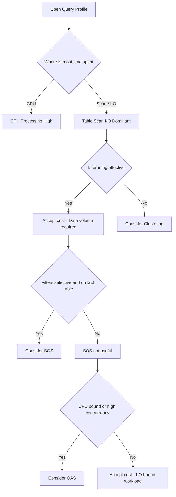

```mermaid
flowchart TD
    A[Open Query Profile] --> B{Where is most time spent}

    B -->|CPU| C[CPU Processing High]
    B -->|Scan / I-O| D[Table Scan I-O Dominant]

    D --> E{Is pruning effective}

    E -->|Yes| F[Accept cost - Data volume required]
    E -->|No| G[Consider Clustering]

    F --> H{Filters selective and on fact table}

    H -->|Yes| I[Consider SOS]
    H -->|No| J[SOS not useful]

    J --> K{CPU bound or high concurrency}

    K -->|Yes| L[Consider QAS]
    K -->|No| M[Accept cost - I-O bound workload]
```
